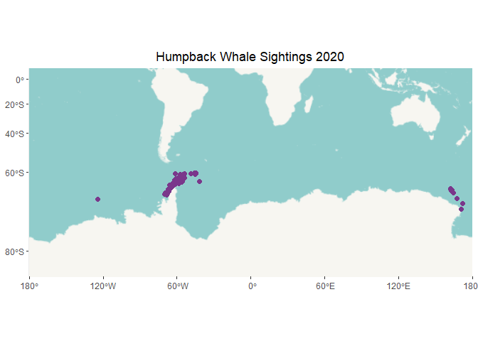
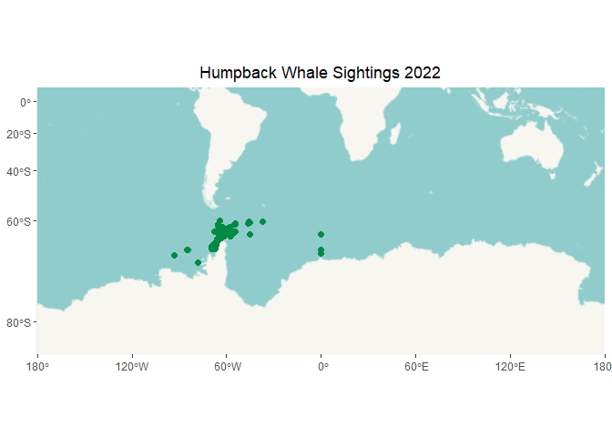
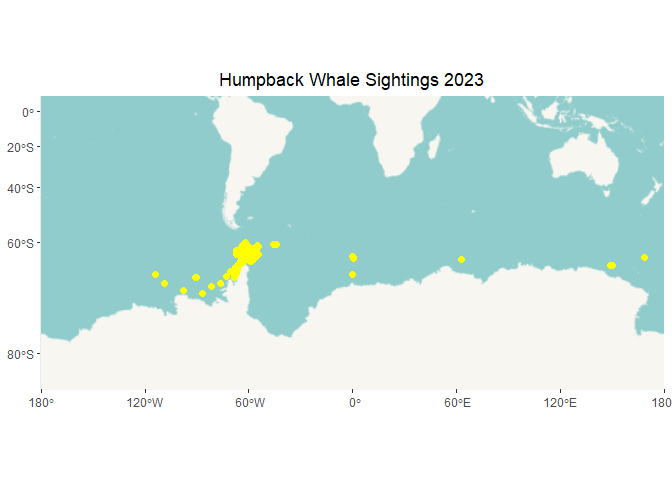
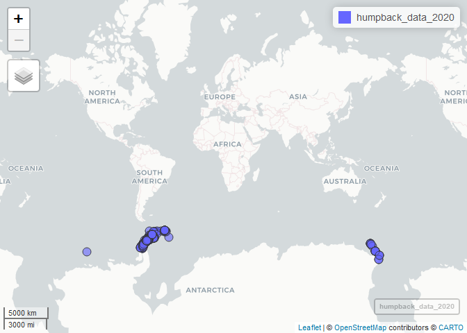

Plotting maps
================
Rahima Baboo
2025-02-27

``` r
#Clear my workspace

rm(list=ls())

#Get working directory

getwd()
```

    ## [1] "C:/Users/Rahima/OneDrive - University of Cape Town/Documents/Rahima postgrad/GIT repos/GIS-Project"

------------------------------------------------------------------------

------------------------------------------------------------------------

\#2020

\##Reading and tidying data

``` r
humpback_data_2020 <- read_delim("C:/Users/Rahima/OneDrive - University of Cape Town/Documents/Rahima postgrad/GIT repos/GIS-Project/Humpback data/Humpback data.csv", delim = ";") 
```

    ## New names:
    ## • `` -> `...14`
    ## • `` -> `...15`
    ## • `` -> `...16`
    ## • `` -> `...17`
    ## • `` -> `...18`
    ## • `` -> `...19`

    ## Warning: One or more parsing issues, call `problems()` on your data frame for details,
    ## e.g.:
    ##   dat <- vroom(...)
    ##   problems(dat)

    ## Rows: 1048575 Columns: 19
    ## ── Column specification ────────────────────────────────────────────────────────
    ## Delimiter: ";"
    ## chr (6): order, family, genus, species, taxon, Date
    ## dbl (7): ID, Count, Latitude, Longitude, day, month, year
    ## lgl (6): ...14, ...15, ...16, ...17, ...18, ...19
    ## 
    ## ℹ Use `spec()` to retrieve the full column specification for this data.
    ## ℹ Specify the column types or set `show_col_types = FALSE` to quiet this message.

``` r
#Create a data frame
humpback_data_2020 <- as.data.frame(humpback_data_2020)

# Remove columns 15 to 20

humpback_data_2020 <- dplyr::select(humpback_data_2020, -c(14:19))

#select only 2020 data from this code
humpback_data_2020 <- humpback_data_2020 %>%
  filter(year == 2020, month %in% c(1, 2, 3, 11, 12))

#remove duplicate rows based on all columns
humpback_data_2020 <- humpback_data_2020 %>%
  distinct()
```

\##converting data frame to spatial object

``` r
library(mapview)
library(leafpop)

humpback_data_2020 <- st_as_sf(humpback_data_2020, coords = c("Longitude", "Latitude"), crs = 4326)

class(humpback_data_2020)
```

    ## [1] "sf"         "data.frame"

``` r
names(humpback_data_2020)
```

    ##  [1] "ID"       "order"    "family"   "genus"    "species"  "taxon"   
    ##  [7] "Count"    "Date"     "day"      "month"    "year"     "geometry"

\##Checking crs

``` r
st_crs(humpback_data_2020)
```

    ## Coordinate Reference System:
    ##   User input: EPSG:4326 
    ##   wkt:
    ## GEOGCRS["WGS 84",
    ##     ENSEMBLE["World Geodetic System 1984 ensemble",
    ##         MEMBER["World Geodetic System 1984 (Transit)"],
    ##         MEMBER["World Geodetic System 1984 (G730)"],
    ##         MEMBER["World Geodetic System 1984 (G873)"],
    ##         MEMBER["World Geodetic System 1984 (G1150)"],
    ##         MEMBER["World Geodetic System 1984 (G1674)"],
    ##         MEMBER["World Geodetic System 1984 (G1762)"],
    ##         MEMBER["World Geodetic System 1984 (G2139)"],
    ##         MEMBER["World Geodetic System 1984 (G2296)"],
    ##         ELLIPSOID["WGS 84",6378137,298.257223563,
    ##             LENGTHUNIT["metre",1]],
    ##         ENSEMBLEACCURACY[2.0]],
    ##     PRIMEM["Greenwich",0,
    ##         ANGLEUNIT["degree",0.0174532925199433]],
    ##     CS[ellipsoidal,2],
    ##         AXIS["geodetic latitude (Lat)",north,
    ##             ORDER[1],
    ##             ANGLEUNIT["degree",0.0174532925199433]],
    ##         AXIS["geodetic longitude (Lon)",east,
    ##             ORDER[2],
    ##             ANGLEUNIT["degree",0.0174532925199433]],
    ##     USAGE[
    ##         SCOPE["Horizontal component of 3D system."],
    ##         AREA["World."],
    ##         BBOX[-90,-180,90,180]],
    ##     ID["EPSG",4326]]

``` r
class(humpback_data_2020)
```

    ## [1] "sf"         "data.frame"

\##plot

``` r
ggplot() + geom_sf(data=humpback_data_2020)
```

<!-- -->

``` r
whale_2020 <- ggplot() + 
  annotation_map_tile(type = "hotstyle", progress = "none") + 
  geom_sf(data = humpback_data_2020, color = "mediumorchid4", size = 2, show.legend = FALSE) + 
  labs(title = "Humpback Whale Sightings 2020") +
  theme(legend.position = "none",
        plot.title = element_text(hjust = 0.5)) +
  coord_sf(xlim = c(-18237508, 18237508), ylim = c(-17037508, 94688))  # Set global coordinate limits


plot(whale_2020)
```

<!-- -->

\##save image

``` r
ggsave("whale_2020_plot.png", plot = whale_2020, width = 8, height = 4, dpi = 300)
```

\#2021

\##Reading and tidying data

``` r
humpback_data_2021 <- read_delim("C:/Users/Rahima/OneDrive - University of Cape Town/Documents/Rahima postgrad/GIT repos/GIS-Project/Humpback data/Humpback data.csv", delim = ";") 
```

    ## New names:
    ## • `` -> `...14`
    ## • `` -> `...15`
    ## • `` -> `...16`
    ## • `` -> `...17`
    ## • `` -> `...18`
    ## • `` -> `...19`

    ## Warning: One or more parsing issues, call `problems()` on your data frame for details,
    ## e.g.:
    ##   dat <- vroom(...)
    ##   problems(dat)

    ## Rows: 1048575 Columns: 19
    ## ── Column specification ────────────────────────────────────────────────────────
    ## Delimiter: ";"
    ## chr (6): order, family, genus, species, taxon, Date
    ## dbl (7): ID, Count, Latitude, Longitude, day, month, year
    ## lgl (6): ...14, ...15, ...16, ...17, ...18, ...19
    ## 
    ## ℹ Use `spec()` to retrieve the full column specification for this data.
    ## ℹ Specify the column types or set `show_col_types = FALSE` to quiet this message.

``` r
#Create a data frame
humpback_data_2021 <- as.data.frame(humpback_data_2021)

library(dplyr)

# Remove columns 14 to 20

humpback_data_2021 <- dplyr::select(humpback_data_2021, -c(14:19))

#select only 2020 data from this code
humpback_data_2021 <- humpback_data_2021 %>%
  filter(year == 2021, month %in% c(1, 2, 3, 11, 12))

#remove duplicate rows based on all columns
humpback_data_2021 <- humpback_data_2021 %>%
  distinct()
```

\##converting data frame to spatial object

``` r
library(mapview)
library(leafpop)

humpback_data_2021 <- st_as_sf(humpback_data_2021, coords = c("Longitude", "Latitude"), crs = 4326)

class(humpback_data_2021)
```

    ## [1] "sf"         "data.frame"

``` r
names(humpback_data_2021)
```

    ##  [1] "ID"       "order"    "family"   "genus"    "species"  "taxon"   
    ##  [7] "Count"    "Date"     "day"      "month"    "year"     "geometry"

\##Checking crs

``` r
st_crs(humpback_data_2021)
```

    ## Coordinate Reference System:
    ##   User input: EPSG:4326 
    ##   wkt:
    ## GEOGCRS["WGS 84",
    ##     ENSEMBLE["World Geodetic System 1984 ensemble",
    ##         MEMBER["World Geodetic System 1984 (Transit)"],
    ##         MEMBER["World Geodetic System 1984 (G730)"],
    ##         MEMBER["World Geodetic System 1984 (G873)"],
    ##         MEMBER["World Geodetic System 1984 (G1150)"],
    ##         MEMBER["World Geodetic System 1984 (G1674)"],
    ##         MEMBER["World Geodetic System 1984 (G1762)"],
    ##         MEMBER["World Geodetic System 1984 (G2139)"],
    ##         MEMBER["World Geodetic System 1984 (G2296)"],
    ##         ELLIPSOID["WGS 84",6378137,298.257223563,
    ##             LENGTHUNIT["metre",1]],
    ##         ENSEMBLEACCURACY[2.0]],
    ##     PRIMEM["Greenwich",0,
    ##         ANGLEUNIT["degree",0.0174532925199433]],
    ##     CS[ellipsoidal,2],
    ##         AXIS["geodetic latitude (Lat)",north,
    ##             ORDER[1],
    ##             ANGLEUNIT["degree",0.0174532925199433]],
    ##         AXIS["geodetic longitude (Lon)",east,
    ##             ORDER[2],
    ##             ANGLEUNIT["degree",0.0174532925199433]],
    ##     USAGE[
    ##         SCOPE["Horizontal component of 3D system."],
    ##         AREA["World."],
    ##         BBOX[-90,-180,90,180]],
    ##     ID["EPSG",4326]]

``` r
class(humpback_data_2021)
```

    ## [1] "sf"         "data.frame"

\##plot

``` r
ggplot() + geom_sf(data=humpback_data_2021)
```

<!-- -->

``` r
whale_2021 <- ggplot() + 
  annotation_map_tile(type = "hotstyle", progress = "none") + 
  geom_sf(data = humpback_data_2021, color = "royalblue4", size = 2, show.legend = FALSE) + 
  labs(title = "Humpback Whale Sightings 2021") +
  theme(legend.position = "none",
        plot.title = element_text(hjust = 0.5)) +
  coord_sf(xlim = c(-18237508, 18237508), ylim = c(-17037508, 94688)) +
  coord_sf(xlim = c(-18237508, 18237508), ylim = c(-17037508, 94688))  # Set global coordinate limits
```

    ## Coordinate system already present. Adding new coordinate system, which will
    ## replace the existing one.

``` r
plot(whale_2021)
```

<!-- -->

\##save image

``` r
ggsave("whale_2021_plot.png", plot = whale_2021, width = 8, height = 4, dpi = 300)
```

\#2022

\##Reading and tidying the data

``` r
humpback_data_2022 <- read_delim("C:/Users/Rahima/OneDrive - University of Cape Town/Documents/Rahima postgrad/GIT repos/GIS-Project/Humpback data/Humpback data.csv", delim = ";") 
```

    ## New names:
    ## • `` -> `...14`
    ## • `` -> `...15`
    ## • `` -> `...16`
    ## • `` -> `...17`
    ## • `` -> `...18`
    ## • `` -> `...19`

    ## Warning: One or more parsing issues, call `problems()` on your data frame for details,
    ## e.g.:
    ##   dat <- vroom(...)
    ##   problems(dat)

    ## Rows: 1048575 Columns: 19
    ## ── Column specification ────────────────────────────────────────────────────────
    ## Delimiter: ";"
    ## chr (6): order, family, genus, species, taxon, Date
    ## dbl (7): ID, Count, Latitude, Longitude, day, month, year
    ## lgl (6): ...14, ...15, ...16, ...17, ...18, ...19
    ## 
    ## ℹ Use `spec()` to retrieve the full column specification for this data.
    ## ℹ Specify the column types or set `show_col_types = FALSE` to quiet this message.

``` r
#Create a data frame
humpback_data_2022 <- as.data.frame(humpback_data_2022)

library(dplyr)

# Remove columns 14 to 20

humpback_data_2022 <- dplyr::select(humpback_data_2022, -c(14:19))

#select only 2020 data from this code
humpback_data_2022 <- humpback_data_2022 %>%
  filter(year == 2022, month %in% c(1, 2, 3, 11, 12))

#remove duplicate rows based on all columns
humpback_data_2022 <- humpback_data_2022 %>%
  distinct()
```

\##converting data frame to spatial object

``` r
library(mapview)
library(leafpop)

humpback_data_2022 <- st_as_sf(humpback_data_2022, coords = c("Longitude", "Latitude"), crs = 4326)

class(humpback_data_2022)
```

    ## [1] "sf"         "data.frame"

``` r
names(humpback_data_2022)
```

    ##  [1] "ID"       "order"    "family"   "genus"    "species"  "taxon"   
    ##  [7] "Count"    "Date"     "day"      "month"    "year"     "geometry"

\##Checking crs

``` r
st_crs(humpback_data_2022)
```

    ## Coordinate Reference System:
    ##   User input: EPSG:4326 
    ##   wkt:
    ## GEOGCRS["WGS 84",
    ##     ENSEMBLE["World Geodetic System 1984 ensemble",
    ##         MEMBER["World Geodetic System 1984 (Transit)"],
    ##         MEMBER["World Geodetic System 1984 (G730)"],
    ##         MEMBER["World Geodetic System 1984 (G873)"],
    ##         MEMBER["World Geodetic System 1984 (G1150)"],
    ##         MEMBER["World Geodetic System 1984 (G1674)"],
    ##         MEMBER["World Geodetic System 1984 (G1762)"],
    ##         MEMBER["World Geodetic System 1984 (G2139)"],
    ##         MEMBER["World Geodetic System 1984 (G2296)"],
    ##         ELLIPSOID["WGS 84",6378137,298.257223563,
    ##             LENGTHUNIT["metre",1]],
    ##         ENSEMBLEACCURACY[2.0]],
    ##     PRIMEM["Greenwich",0,
    ##         ANGLEUNIT["degree",0.0174532925199433]],
    ##     CS[ellipsoidal,2],
    ##         AXIS["geodetic latitude (Lat)",north,
    ##             ORDER[1],
    ##             ANGLEUNIT["degree",0.0174532925199433]],
    ##         AXIS["geodetic longitude (Lon)",east,
    ##             ORDER[2],
    ##             ANGLEUNIT["degree",0.0174532925199433]],
    ##     USAGE[
    ##         SCOPE["Horizontal component of 3D system."],
    ##         AREA["World."],
    ##         BBOX[-90,-180,90,180]],
    ##     ID["EPSG",4326]]

``` r
class(humpback_data_2022)
```

    ## [1] "sf"         "data.frame"

\##plot

``` r
ggplot() + geom_sf(data=humpback_data_2022)
```

<!-- -->

``` r
whale_2022 <- ggplot() + 
  annotation_map_tile(type = "hotstyle", progress = "none") + 
  geom_sf(data = humpback_data_2022, color = "springgreen4", size = 2, show.legend = FALSE) + 
  labs(title = "Humpback Whale Sightings 2022") +
  theme(legend.position = "none",
        plot.title = element_text(hjust = 0.5)) +
  coord_sf(xlim = c(-18237508, 18237508), ylim = c(-17037508, 94688)) +
  coord_sf(xlim = c(-18237508, 18237508), ylim = c(-17037508, 94688))  # Set global coordinate limits
```

    ## Coordinate system already present. Adding new coordinate system, which will
    ## replace the existing one.

``` r
plot(whale_2022)
```

<!-- -->

\##save image

``` r
ggsave("whale_2022_plot.png", plot = whale_2022, width = 8, height = 4, dpi = 300)
```

\#2023

\##Reading and tidying the data

``` r
humpback_data_2023 <- read_delim("C:/Users/Rahima/OneDrive - University of Cape Town/Documents/Rahima postgrad/GIT repos/GIS-Project/Humpback data/Humpback data.csv", delim = ";") 
```

    ## New names:
    ## • `` -> `...14`
    ## • `` -> `...15`
    ## • `` -> `...16`
    ## • `` -> `...17`
    ## • `` -> `...18`
    ## • `` -> `...19`

    ## Warning: One or more parsing issues, call `problems()` on your data frame for details,
    ## e.g.:
    ##   dat <- vroom(...)
    ##   problems(dat)

    ## Rows: 1048575 Columns: 19
    ## ── Column specification ────────────────────────────────────────────────────────
    ## Delimiter: ";"
    ## chr (6): order, family, genus, species, taxon, Date
    ## dbl (7): ID, Count, Latitude, Longitude, day, month, year
    ## lgl (6): ...14, ...15, ...16, ...17, ...18, ...19
    ## 
    ## ℹ Use `spec()` to retrieve the full column specification for this data.
    ## ℹ Specify the column types or set `show_col_types = FALSE` to quiet this message.

``` r
#Create a data frame
humpback_data_2023 <- as.data.frame(humpback_data_2023)

library(dplyr)

# Remove columns 14 to 20

humpback_data_2023 <- dplyr::select(humpback_data_2023, -c(14:19))

#select only 2020 data from this code
humpback_data_2023 <- humpback_data_2023 %>%
  filter(year == 2023, month %in% c(1, 2, 3, 11, 12))

#remove duplicate rows based on all columns
humpback_data_2023 <- humpback_data_2023 %>%
  distinct()
```

\##converting data frame to spatial object

``` r
library(mapview)
library(leafpop)

humpback_data_2023 <- st_as_sf(humpback_data_2023, coords = c("Longitude", "Latitude"), crs = 4326)

class(humpback_data_2023)
```

    ## [1] "sf"         "data.frame"

``` r
names(humpback_data_2023)
```

    ##  [1] "ID"       "order"    "family"   "genus"    "species"  "taxon"   
    ##  [7] "Count"    "Date"     "day"      "month"    "year"     "geometry"

\##Checking crs

``` r
st_crs(humpback_data_2023)
```

    ## Coordinate Reference System:
    ##   User input: EPSG:4326 
    ##   wkt:
    ## GEOGCRS["WGS 84",
    ##     ENSEMBLE["World Geodetic System 1984 ensemble",
    ##         MEMBER["World Geodetic System 1984 (Transit)"],
    ##         MEMBER["World Geodetic System 1984 (G730)"],
    ##         MEMBER["World Geodetic System 1984 (G873)"],
    ##         MEMBER["World Geodetic System 1984 (G1150)"],
    ##         MEMBER["World Geodetic System 1984 (G1674)"],
    ##         MEMBER["World Geodetic System 1984 (G1762)"],
    ##         MEMBER["World Geodetic System 1984 (G2139)"],
    ##         MEMBER["World Geodetic System 1984 (G2296)"],
    ##         ELLIPSOID["WGS 84",6378137,298.257223563,
    ##             LENGTHUNIT["metre",1]],
    ##         ENSEMBLEACCURACY[2.0]],
    ##     PRIMEM["Greenwich",0,
    ##         ANGLEUNIT["degree",0.0174532925199433]],
    ##     CS[ellipsoidal,2],
    ##         AXIS["geodetic latitude (Lat)",north,
    ##             ORDER[1],
    ##             ANGLEUNIT["degree",0.0174532925199433]],
    ##         AXIS["geodetic longitude (Lon)",east,
    ##             ORDER[2],
    ##             ANGLEUNIT["degree",0.0174532925199433]],
    ##     USAGE[
    ##         SCOPE["Horizontal component of 3D system."],
    ##         AREA["World."],
    ##         BBOX[-90,-180,90,180]],
    ##     ID["EPSG",4326]]

``` r
class(humpback_data_2023)
```

    ## [1] "sf"         "data.frame"

\##plot

``` r
ggplot() + geom_sf(data=humpback_data_2023)
```

<!-- -->

``` r
whale_2023 <- ggplot() + 
  annotation_map_tile(type = "hotstyle", progress = "none") + 
  geom_sf(data = humpback_data_2023, color = "yellow1", size = 2, show.legend = FALSE) + 
  labs(title = "Humpback Whale Sightings 2023") +
  theme(legend.position = "none",
        plot.title = element_text(hjust = 0.5)) +
  coord_sf(xlim = c(-18237508, 18237508), ylim = c(-17037508, 94688)) +
  coord_sf(xlim = c(-18237508, 18237508), ylim = c(-17037508, 94688))  # Set global coordinate limits
```

    ## Coordinate system already present. Adding new coordinate system, which will
    ## replace the existing one.

``` r
plot(whale_2023)
```

<!-- -->

\##save image

``` r
ggsave("whale_2023_plot.png", plot = whale_2023, width = 8, height = 4, dpi = 300)
```

------------------------------------------------------------------------

\#Interactive map

\##Default openstreet map tiles

``` r
leaflet() %>%
  # Add default OpenStreetMap map tiles
  addTiles(group = "Default") %>%  
  # Add our points
  addCircleMarkers(data = humpback_data_2020,
                   group = "Humpback whales 2020",
                   radius = 3, 
                   color = "darkred") 
```

<!-- -->

\##Common sense checks with the data

``` r
mapview(humpback_data_2020, 
        popup =  popupTable(humpback_data_2020,
            zcol = c("geometry", "ID")))
```

<!-- -->

\##Adding all data points to the map

``` r
library(dplyr)

humpback_sightings <- bind_rows(humpback_data_2020, humpback_data_2021, humpback_data_2022, humpback_data_2023)
```

class(humpback_data_all)

``` r
humpback_sightings$year <- as.factor(humpback_sightings$year)

int.map <- mapview(humpback_sightings, 
        zcol = "year",
        popup =  popupTable(humpback_sightings,
            zcol = c("geometry", "year")))

int.map
```

<!-- -->

\##save interactive map

``` r
mapshot(int.map, file = "Humpback_whale_int.map.jpeg")
```
